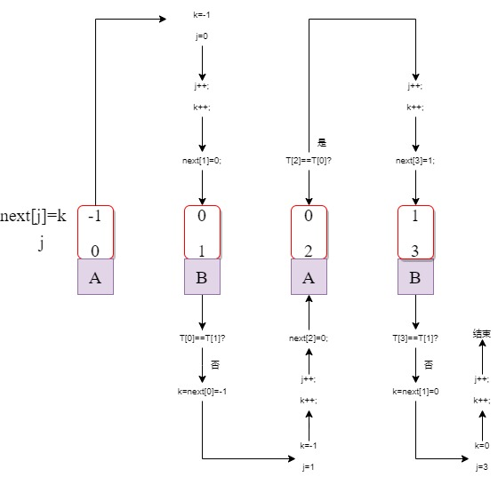

# KMP模式匹配算法
朴素模式匹配算法逐个比较，效率很低，造成低效的原因是在当前串不匹配时，主串的`i`指针需要回溯到上一次匹配起点，模式串`T`的`j`指针要进行回溯到第一个字符。 
KMP算法是由D.E.Knuth、J.H.Morris和V.R.Pratt三个人发表的，故叫“KMP算法”。
## 思想
算法的<b>任务</b>是对于模式串`T`，在主串`S`中进行定位，返回出现模式串`T`在主串中的位置下标。KMP算法希望<b>只改变模式串的`j`指针的回溯位置，主串`i`指针不回溯，让模式串`j`指针移动到适合的位置进行比较。</b>

[注] 
1、KMP算法仅当模式串和主串之间存在许多“部分匹配”的情况下才能体现出优势； 
2、模式串自身尽量有一定的序列重复性，以方便模式串的`j`指针回溯。
## 做法
1、对于每个字符`t_j`，找到前面的最大重复串的长度`K`。 
对于模式串`T`的每个字符`t_j`，都存在一个实数`k`，使得模式串`T`开头的前`k`个字符(`t_0,t_1,...,t_{k-1}`)和`t_j`前面顺序的`k`个字符(`t_{j-k}, ..., t_{j-2}, t_{j-1}`)相同`(其中k > j-k)`，如果这样的`k`有多个，则取最大的一个`K`。采用`next`数组把字符`t_j`前面对应的`K`存下来。即`next[j] = K`。 

2、为什么要找最大重复子串？ 
对于主串`S`来说，模式串的每个位置都可能发生不匹配，<B>而`next[j] = K`就是当`S[i] != T[j]`时，`j`指针下一步要回溯的位置。</b> 
例1如下。 
`K=1`，最大重复串为"`A`"，其长度为`K=1`。
 
`j`下一步指向`K`的位置，即"`B`"的位置。
 
例2如下。 
`K=1`，最大重复串为"`AB`"，其长度为`K=2`。
 
`j`下一步指向`K`的位置，即"`C`"的位置。
 

3、怎么求最大重复子串的长度`K`？ 
由上可知，`K`值实际是`j`位前的子串的最大重复子串的长度，也表示当`S[i] != T[j]`时，`j`指针下一步的移动位置。 
1) 当j=0时不匹配，设定`next[0] = -1`；
2) 当j=1时不匹配，`j`指针的下一个位置只能是`0`，`next[1] = 0`；
3) 为求`next[2]，next[3]...`，有规律如下。 
   i) 当`T[k] == T[j]`时，相当于发现了更长的重复子串，所以`next[j+1] = next[j] + 1 == K + 1`。
 
  
    ii) 当`T[k] != T[j]`时，如下所示。
 
如果我们把`0~k`看成模式串`T1`("ABAC")，把`j-k~j`看成是主串`S1`("ABABC")，那么问题就从原来的当`S[i] != T[j]`时，`j`指针下一步要回溯的位置。变成了当前的当`S1[j] != T1[k]`("C"!="B")时，`k`指针下一步要回溯的位置。原来的`j`下一步到`next[j]`的位置，所以现在的`k`要到`next[k]`的位置，故`k = next[k]`。(把`j`看作`i`，把`k`当作`j`)
  
1) next数组求解优化 
为进一步提高next数组的生成效率，在主串不匹配时，如果存在`T[j] == T[next[j]]`，此时就是把`j`下一步指向`next[j] = k`还是不匹配，如下所示。
 
 
故可直接指向`next[next[j]]`，即`next[j] = next[k]`。

## 复杂度
假定主串长度为`n`，模式串为`m`，两者都是单次遍历。 
时间：`O(n+m)`

## 图解next数组代码过程
 

## 参考
1、https://www.cnblogs.com/yjiyjige/p/3263858.html 
2、https://blog.csdn.net/dark_cy/article/details/88698736 
3、https://www.cnblogs.com/dusf/p/kmp.html  