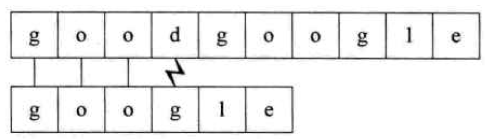
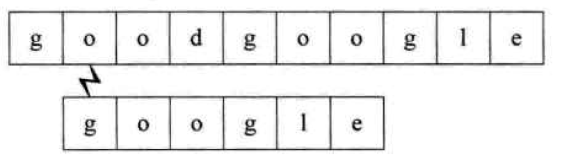
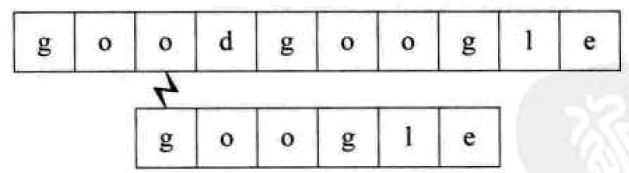
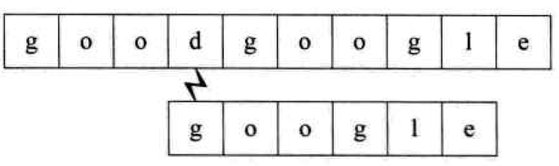
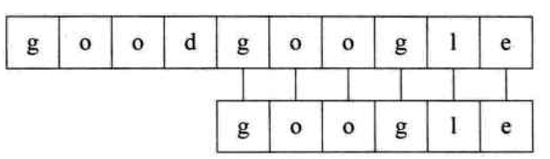

# 串
## 概念
零个或多个字符组成的<b>有限序列</b>。又叫字符串(string)。记为`s="a1a2...an"(n>=0)`。
### 1) 空串
零个字符的串叫空串。记为`""`。
### 2) 空格串
只包含空格的串，可以有多个空格。记为`"  "`。
### 3) 子串和主串
在模式匹配中，主串`S`称为目标串，子串`S`称为模式串，如果主串`S`能够找到子串`T`，则返回第一个子串在主串中出现的下标，表示匹配成功。

# 朴素的模式匹配算法

## 思想
在主串中找到出现子串的<b>位置</b>。主串`S`能够找到子串`T`，则返回第一个子串在主串中出现的下标，表示匹配成功。
## 做法
1、输入主串`S`开始匹配的位置，从主串`S`的第`pos`个位置开始，直到两个串有一个串结束为止； 
2、和子串`T`的第一个字符相比，若相同，`i++;j++;`，接着往下比较。 
3、若有不同，则主串返回上一次匹配的下一个字符，也就是第`i-j+2`位置的字符进行比较，子串位置回退到第一个字符。 
4、比较结束后，若子串指针`j > T.size()-1`，说明匹配成功，返回匹配成功的第一个字符的下标`i - T.size()`；否则返回`-1`。
## 复杂度
假设主串`S`长度为n，子串`T`长度为m。 
最好时间：`O(1)` 
最坏时间：`O(m*(n-m+1))` 
## 图解

## 参考
1、https://www.cnblogs.com/kubixuesheng/p/4322410.html 
2、书籍：大话数据结构