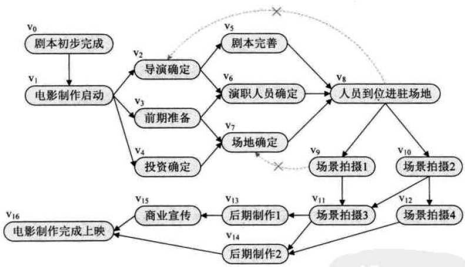
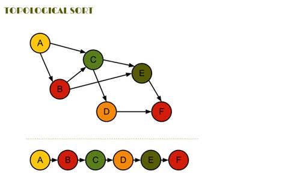

# 拓扑排序
<b>`AOV`网的概念</b>：在一个表示工程中，用顶点表示活动，用弧表示活动之间的优先关系，这种有向图成为`AOV`网(Activity On Vertex Network)。如下所示。 

<b>拓扑序列的概念</b>：设`G(V,E)`是一个`n`个顶点的有向图，`V`中的顶点序列`v1, v2, v3, ..., vn`。如果满足从顶点`vi`到`vj`，并且在序列中`vi`必须出现在`vj`的前面，这种序列称为拓扑序列。

## 思想
拓扑排序是针对有向图顶点的来构造拓扑序列的过程。若整个网络的顶点全部输出，说明它是无环的AOV网。否则网络存在回路。<b>拓扑排序可来判断有向图是否有回路。</b>

## 逻辑做法
1、从`AOV`网中选择一个入度为0的顶点输出，然后删除该顶点和以此顶点为尾的弧； 
2、继续上述操作直到输出`AOV`网中不存在入度为0的顶点为止。 
如下所示。

1) 选入度为0的节点A，输出A。删除边AB，AC（B入度为1-1=0，C入度为2-1=1）；
2) 选入度为0的节点B，输出B。删除边BC，BE（C入度为1-1=0，E入度为2-1=1）；
3) 选入度为0的节点C，输出C。删边CD，CE（E的入度为0，D的入度也为0）；
4) 重复上述过程。
5) 得到序列`A, B, C, E, D, F`或`A, B, C, D, E, F`
 
<b>注： 拓扑排序结果不唯一</b>（同时有多个入度为0）。

## 代码做法

## 参考
1、书籍：《大话数据结构》 
2、https://blog.csdn.net/been123456789jimmy/article/details/106515465
3、https://blog.csdn.net/wengyupeng/article/details/85005713