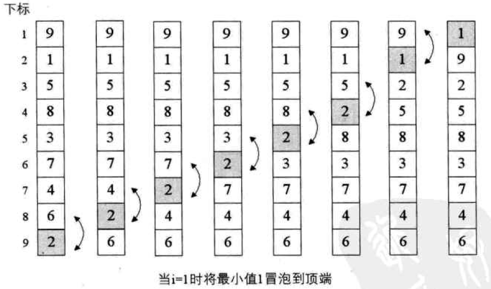
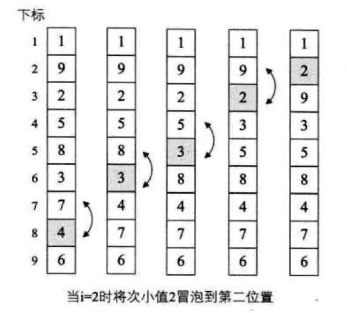

# 冒泡排序
## 思想
数组中的元素像汽水中的气泡一样，每次值小的元素<b>从后往前</b>，通过<b>两两相邻交换</b>的方式“浮出水面”。

## 做法
1、每次从后往前要经历`N`遍； 
2、每一遍都是从后边的元素两两比较后，再看是否交换。

## 复杂度
时间：`O(n^2)`  
空间：`O(n^2)` 
稳定性：稳定

## 图解
待排序数组：[9, 1, 5, 8, 3, 7, 4, 6, 2]  
第一趟遍历示意图：

  
第二趟遍历示意图：

