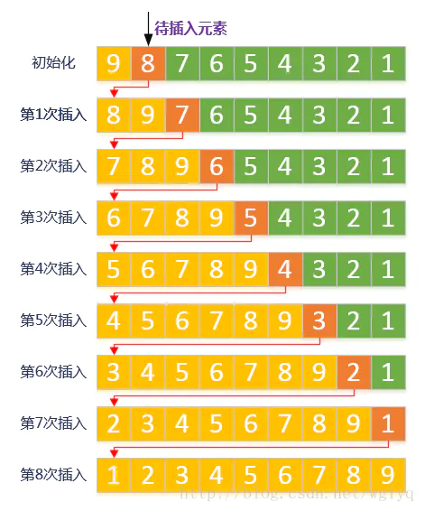

# 直接插入排序
## 思想
第一个元素可看成顺序表，对于未排序的元素，从后往前扫描，找到对应的位置并插入。

## 做法
1、从第二个元素开始，待插入的元素和前一个元素比较看是否需要往前插； 
2、将待插入的元素称为“哨兵”，将“哨兵”从后往前依次和顺序表的元素进行比较； 
3、比“哨兵”大则位置往后挪一个，循环结束时在相应的位置插入“哨兵”。 

## 复杂度
时间：`O(n^2)`  
空间：`O(1)` 
稳定性：稳定

## 图解

## 参考
https://www.jianshu.com/p/7cf0656e76dd