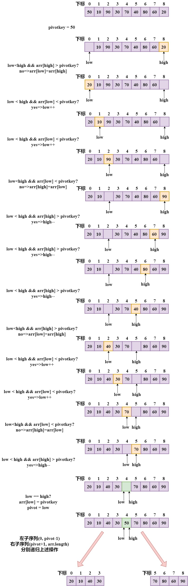

# 快速排序
## 思想
将待排序的序列通过指定序列第一个元素是`pivotkey`，分割成左右独立的两个子序列，其中`左边序列值 < pivotkey < 右边序列值`，然后再对左右序列分别循环上述操作（选`pivotkey`分割独立的左右子序列），从而使得整个序列有序。
## 做法
1、定义`Partition`函数，返回值是`pivotkey`最后存放序列的下标`pivot`； 
2、3个定义：将序列的第一个元素赋值给`pivotkey`，序列的起点下标w为`low`，终点下标为`high`； 
3、在当前序列中，对于`high`，比`pivotkey`大的值应当`high--`，否则直接`swap(low, high);`，对于`low`，比`pivotkey`小的值应当`low++`，否则直接`swap(low, high);`； 
4、最后`low`和`high`相遇后，返回`low`或者`high`作为当前序列的`pivot`； 
5、递归`(0, pivot-1)`和`(pivot+1, arr.length() - 1)`两个子序列。 
## 复杂度
时间：`O(nlog(n))` 
空间：`O(nlog(n))` 
稳定性：不稳定
## 图解
假设待排序的序列是`arr[]={50, 10, 90, 30, 70, 40, 80, 60, 20};` 

