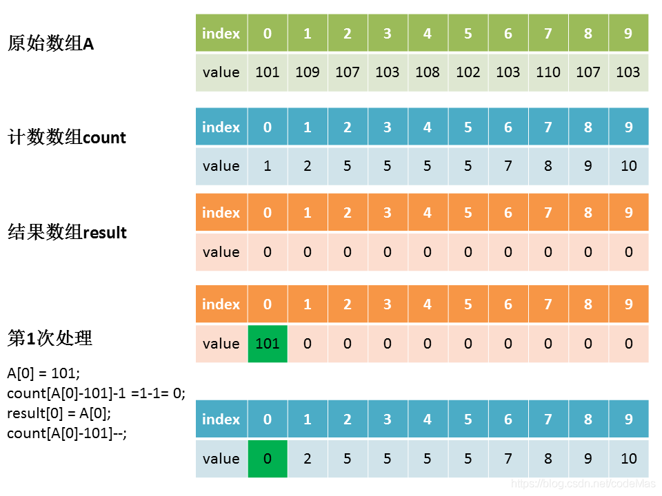
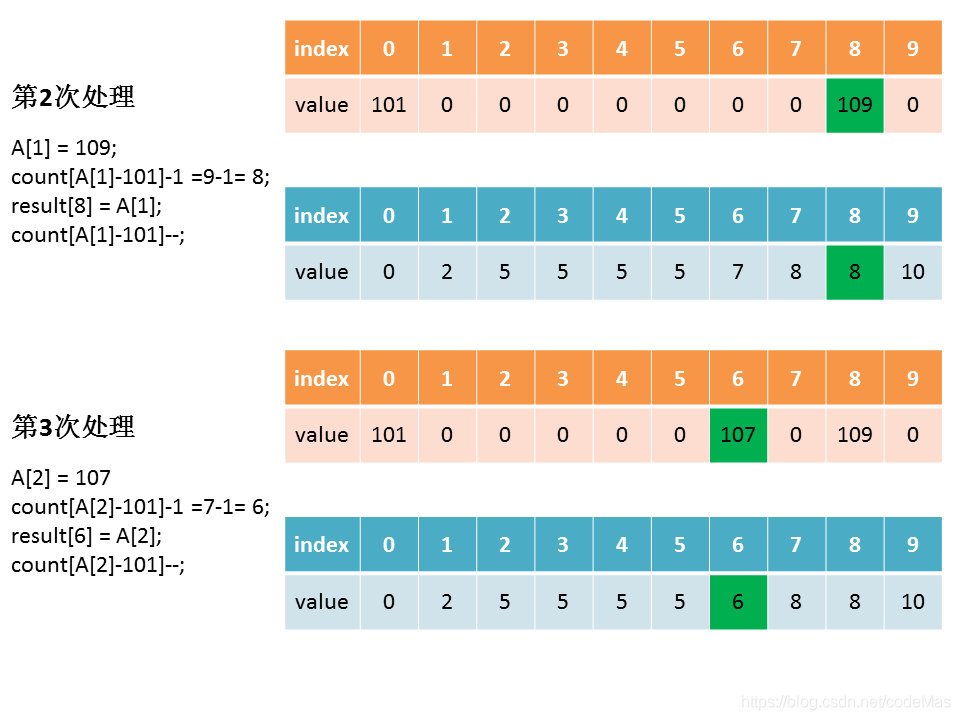
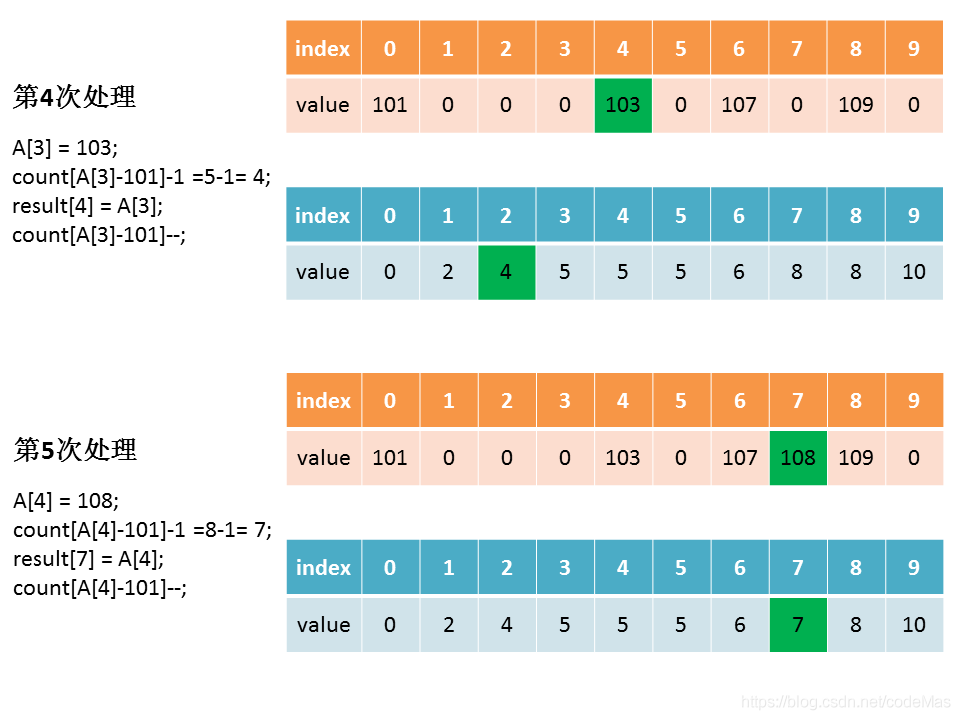
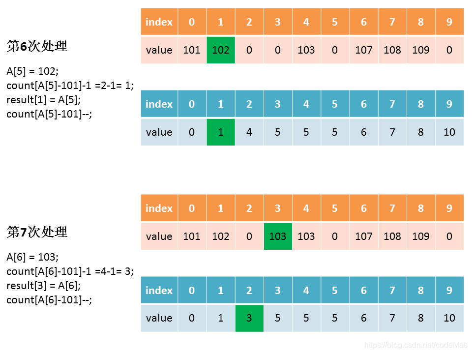
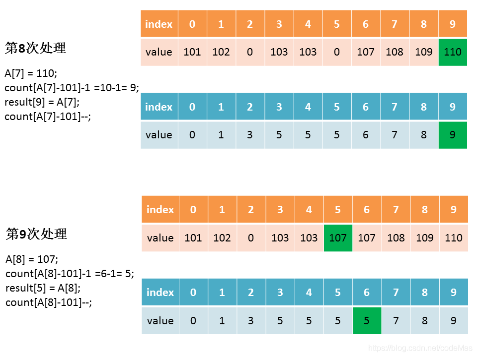
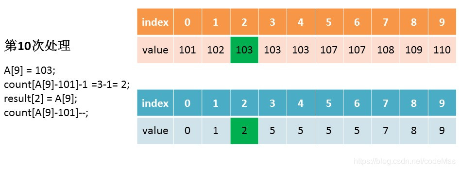

# 计数排序
## 思想
是一种线性时间的排序算法。它是利用计数数组`cnt[]`统计原序列元素出现的次数，<b>利用次数的累加关系</b>生成有序的结果数组对应下标。

## 使用限制
1、排序的元素必须是整数； 
2、排序的元素要均匀落在一定的范围内。 

## 做法
1、遍历序列，找出序列的`max`和`min`； 
2、初始化计数数组`cnt[]`长度为`max-min+1`，统计`元素-min`的出现次数； 
3、计数数组变形(即累加操作)：`cnt[i] += cnt[i - 1]`； 
4、填充空的结果数组，生成结果数组的下标：`result[cnt[arr[j] - min] - 1] = A[j]`。 

## 复杂度
时间：`O(n)` 
空间：`O(n)` 
稳定性：可通过代码设定稳定或不稳定 

## 图解
待排序序列`arr[] = {101, 109, 107, 103, 108, 102, 103, 110, 107, 103}` 

## 参考
https://www.cnblogs.com/xiaochuan94/p/11198610.html