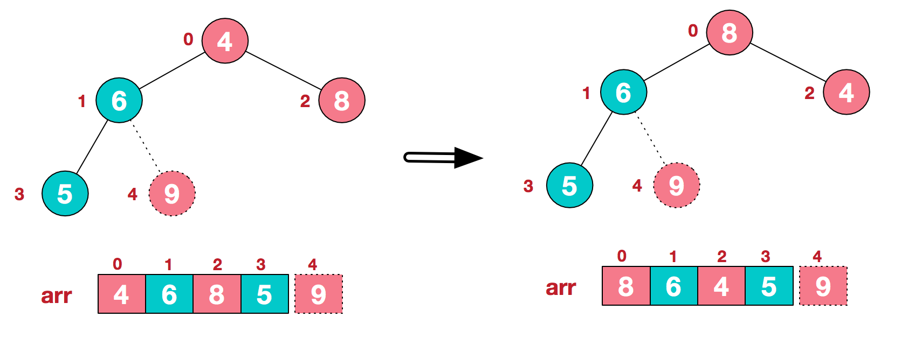
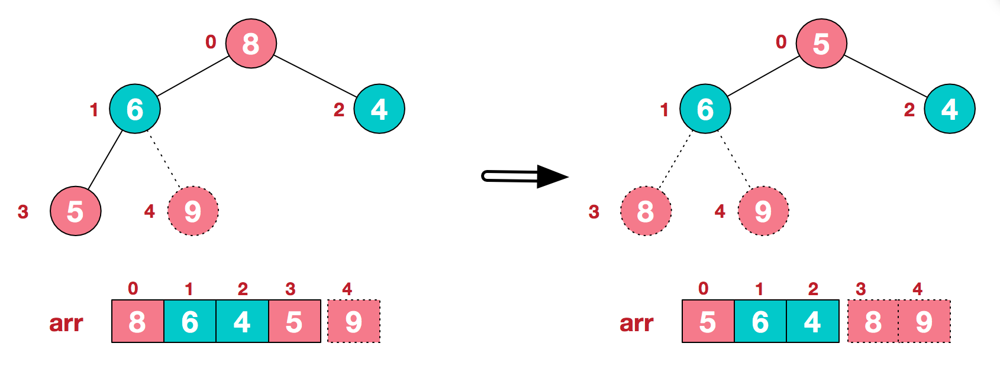

# 堆的概念
堆是一颗<b>完全二叉树</b>，每个结点的值都大于或等于其左右孩子结点的值，称为<b>“大顶堆”</b>，每个结点的值都小于或等于其左右孩子结点的值，称为<b>“小顶堆”</b>。

 
堆结构的物理结构是数组。

若数组满足以下定义，则其逻辑结构是堆。 

`大顶堆：arr[i] >= arr[2i+1] && arr[i] >= arr[2i+2]`

`小顶堆：arr[i] <= arr[2i+1] && arr[i] <= arr[2i+2]`

# 堆排序
是对简单选择排序的改进，在每次选择最小记录的同时，调整其他记录。

## 思想
将无序序列构建成一个堆，将堆顶的元素和末尾的第`n-i`个元素进行交换。

## 做法
1、构建堆：将待排序的序列构建成一个大顶堆(或小顶堆)，即将每个非叶结点当成根结点，将其和子树调整成大顶堆。(循环<b>从下往上，从右往左</b>的最后一个非叶结点(`len/2`)开始) 
2、调整堆：
- 取出待调整的结点`i`元素；
- 找到左孩子(`2*i+1`)和右孩子(`2*i+2`)中最大记录的下标；
- 若孩子结点最大记录大于`i`结点的元素，将两者值进行交换。完成一次非叶结点堆的调整；
- 由于在调整堆的时候，是从根结点出发，<b>从上往下</b>再进行孩子结点的遍历，所以可以防止得到大顶堆时结构混乱。
## 复杂度
时间：`O(nlogn)` 
空间：`O(1)` 
复杂度：不稳定 
## 图解
假定给定的`arr[]={4, 6, 8, 5, 9}`，构建大顶堆的过程为 

将顶点元素和末尾的第`n-i`个元素进行交换。再调整堆。

## 参考
1、https://www.cnblogs.com/chengxiao/p/6129630.html 
2、书籍：《大话数据结构》
