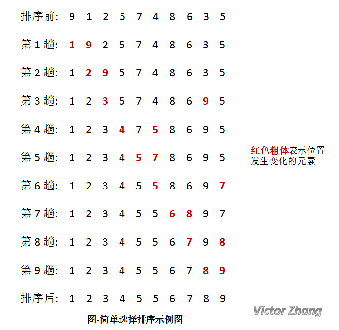

# 简单选择排序
## 思想
至多进行`n-1`趟排序，第`i`个位置的元素是后面的所有`n-i`个元素的最小值。`(i=0, 1, ..., n-2)`

## 做法
1、从`0`到`n-2`进行遍历； 
2、记录第`i`个位置的下标，找到`[i+1, n)`内的最小值； 
3、和第`i`个位置的元素进行交换。 
## 复杂度
时间：`O(n^2)` 
空间：`O(1)` 
稳定性：不稳定 
## 图解
整趟排序过程如下： 
