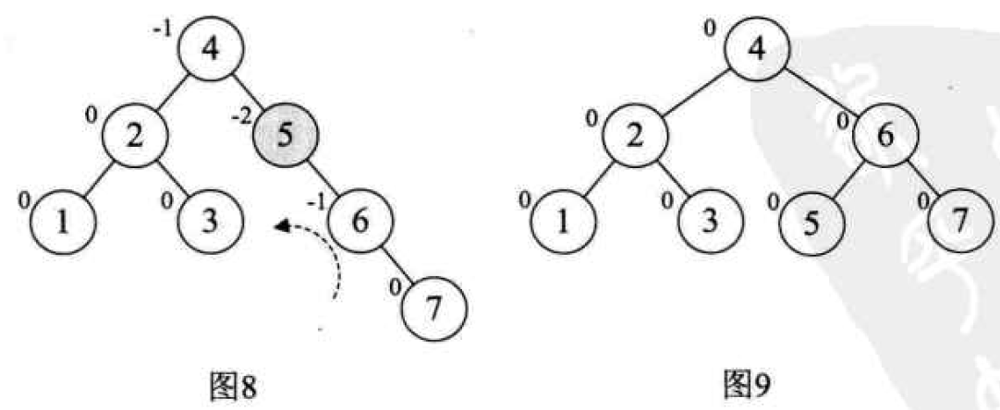

# 平衡二叉树
由两位俄罗斯数学家G.M.Adelson-Velskii和E.M.Landis在1962年共同发明解决平衡二叉树的算法，故又叫`AVL`树。 
平衡二叉树是一种二叉排序树，其中每一个结点左子树和右子树的<b>高度差至多等于1</b>。定义`平衡因子BF=左子树深度-右子树深度`，故BF可能等于`-1, 0, 1`。

## 思想
平衡二叉树可以使得当原序列有序时，提高搜索效率。因为有序序列会使得二叉排序树退化为单链表。如序列`A={1, 2, 3, 4, 5, 6}`，保持树的高度最小，可以保证查找效率。如下图所示。
  
<b>最小不平衡子树概念：</b>距离新插入结点最近的，且`|BF|>1`的结点为根的子树。
 
如上所示，当新插入结点为37时，构成的最小不平衡子树的结点是58。

## 做法
整体思路是在构建二叉排序树的过程中，遇到新插入的结点使得整棵树的`BF>1`时，马上调整树的结构。 
调整规则：
- 对于插入新结点产生的最小不平衡子树中，BF符号相同时， `BF>1`，最小不平衡子树右旋(顺时针旋转)，
 `BF<-1`，最小不平衡子树左旋(逆时针旋转)。
- 如果最小不平衡子树中的`BF`和它的子树`BF`符号相反时，需要统一`BF`的符号。
 最小不平衡子树的`BF=-2`时，最小不平衡子树的子树`BF>0`，要先对它进行右旋(顺时针旋转)，使得和最小不平衡子树的根节点符号统一；
 最小不平衡子树的`BF=2`时，最小不平衡子树的子树`BF<0`，要先对它进行左旋(逆时针旋转)，使得和最小不平衡子树的根节点符号统一。

## 图解生成过程
待生成平衡二叉树的序列是`arr[]={3, 2, 1, 4, 5, 6, 7, 10 9, 8}`。 
1、生成二叉排序树的同时，记录每个结点的`BF`。`BF=2`且最小不平衡子树里各个结点符号都为正，直接将结点`3`右旋如图2所示。图3再新加结点`4`。

 
2、新加结点`5`时，出现最小不平衡子树`BF=2`，且最小不平衡子树里各个结点符号都为负，直接将结点`3`左旋如图5所示。

 
3、新加结点`6`时，出现最小不平衡子树`BF=-2`，且最小不平衡子树里各个结点符号都为负，直接将结点`2`左旋如图6所示。此时结点`2`原来的左孩子要满足二叉排序树的规则，成为结点`2`的右孩子如图7所示。 

 
4、新加结点`7`时，出现最小不平衡子树`BF=-2`，且最小不平衡子树里各个结点符号都为负，直接将结点`6`左旋如图9所示。

 
5、新加结点`10`时，没有出现最小不平衡子树。 
6、新加结点`9`时，出现最小不平衡子树`BF=-2`且根节点为7，且最小不平衡子树里结点符号有正，直接将结点`9`右旋统一子树`BF`的符号，如图12所示。
 

 
统一后，再调整根节点为`7`的最小不平衡子树，如图13所示。 
7、新加结点`8`时，出现最小不平衡子树`BF=-2`且根节点为6，且最小不平衡子树里结点符号有正，直接将结点`9`右旋统一子树`BF`的符号，如图14所示。并且结点`7`原来的右孩子要满足二叉排序树的规则，成为结点`9`的左孩子，如图15所示。 

 
8、调整后，还是出现最小不平衡子树`BF=-2`且根节点为6，且最小不平衡子树里各个结点符号都为负，直接把结点`6`进行左右即可。如图16所示。直至所有的`|BF|<=1`。

## 复杂度
增加：`O(log(n))` 
删除：`O(log(n))` 
查找：`O(log(n))` 

## 参考
1、书籍：大话数据结构
2、https://blog.csdn.net/qq_39559641/article/details/83720734